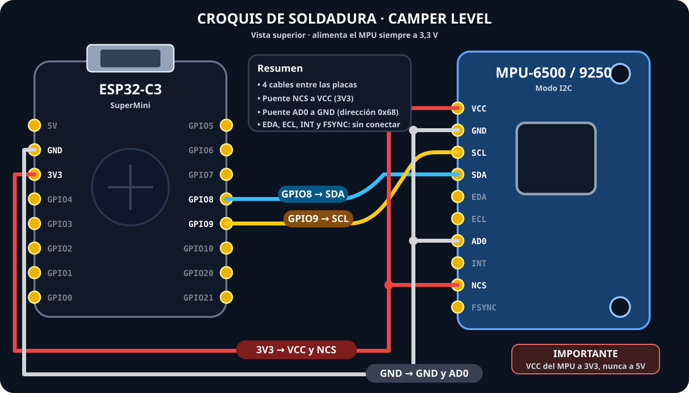

# Cableado ESP32-C3 + MPU



El croquis muestra la vista superior de ambas placas. En el MPU se hacen dos derivaciones:
`VCC` comparte 3V3 con `NCS`, y `GND` comparte masa con `AD0`.

```text
 ESP32-C3 SuperMini                    MPU-6500 / MPU-9250
 ┌─────────────────┐                 ┌────────────────────┐
 │             3V3 ├────────────────►│ VCC                │
 │             GND ├────────────────►│ GND                │
 │ GPIO8       SDA ├────────────────►│ SDA                │
 │ GPIO9       SCL ├────────────────►│ SCL                │
 │             3V3 ├────────────────►│ NCS / CS           │
 │             GND ├────────────────►│ AD0 (0x68)         │
 └─────────────────┘                 └────────────────────┘
```

## Pines no utilizados

- `ECL` y `EDA`: bus auxiliar del MPU; no conectarlos.
- `INT`: no es necesario en esta versión.
- `AD0`: en el montaje recomendado va a GND para `0x68`; 3V3 seleccionaría `0x69`.

## Reglas importantes

- Alimenta el módulo desde **3,3 V**. Solo usa 5 V si la placa concreta garantiza regulación y
  adaptación de niveles; con 3,3 V se evita esa ambigüedad.
- Une todas las masas.
- Conecta `NCS/CS` a 3V3. Dejarlo flotante puede impedir que aparezca en I2C.
- Mantén SDA/SCL cortos y separados de convertidores DC, relés y cables de potencia.
- Fija el sensor rígidamente; la espuma blanda introduce oscilación.
- Comprueba que el monitor detecta `MPU-6500` o `MPU-9250` antes de cerrar la caja.

La altura del sensor y su posición dentro de la camper no cambian el ángulo estático si está unido
rígidamente al mismo plano. La orientación se corrige con `swap_axes`, `invert_pitch`,
`invert_roll` y **Nivel 0**.
